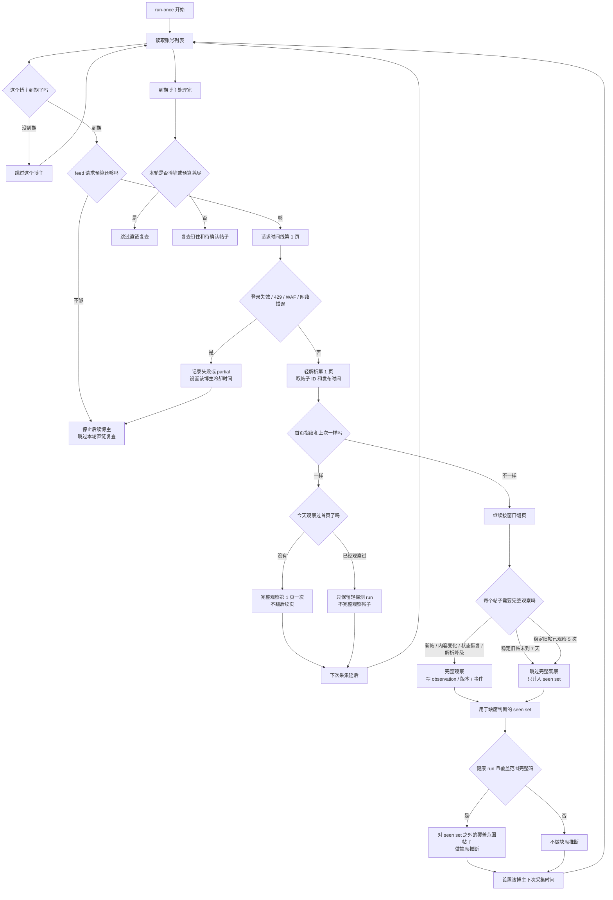

# stock-tools

本地单用户 KOL 发言证据存档。当前已完成追加式归档、证据卡片、本地网页、批量富化、
博主市场相关观点总览、图片下载/OCR/VLM 描述、个人决策日志、关注列表、中性统计分析、
分析框架提取、日线 K 线行情，以及主题回溯与历史简报（词法 RAG）。

## 初始化

```powershell
.\.venv\Scripts\python.exe -m pip install -r requirements-dev.txt
.\.venv\Scripts\python.exe -m kol_archive init-db data/kol.sqlite3
```

复制 `config/config.yml` 为 `config/config.local.yml`，填写追踪账号。

## 浏览器登录（默认采集通道）

雪球数据路径前置了阿里云 WAF + 滑块，纯 httpx 与 Playwright 自带 Chromium 都会被拦
（见 [probe/probe_findings.md](probe/probe_findings.md) §14）。默认采集通道改用**本机已装的真实
Edge** + CDP：先人工登录一次（必要时过一次滑块），之后复用持久化 profile。`requirements.txt`
已声明 `playwright`；**无需** `playwright install` 捆绑浏览器，因为连接的是真实 Edge。

```powershell
# 1) 启动专用浏览器（持久化 profile + CDP 端口），在弹出的窗口里登录雪球、必要时过一次滑块
.\.venv\Scripts\python.exe -m kol_archive login --config-dir config
#    等价的纯脚本启动（端口/profile 同默认值）：
#    .\start_xueqiu_browser.ps1
```

注意：Edge **首次**创建 profile 后约 10 余秒才会绑定 CDP 端口，属正常。登录窗口需**保持开着**，
随后运行 `run-once` 即可。专用浏览器配置在 `config/config.yml` 的 `browser` 段：`enabled`
切换数据通道（默认 `true` 走浏览器；置 `false` 回退 httpx 直连，已被 WAF 拦，仅离线/历史用），
`cdp_url`、`profile_dir`（被 gitignore）、`edge_path`（留空自动探测 `msedge.exe`，可手动指向
`msedge.exe` 或 `chrome.exe`）。登录态来自浏览器 profile，无需再配 cookie。

## 添加博主

追踪账号的来源是配置；新增博主无需手填数字 uid，也不必手改 `config.local.yml`：

```powershell
# 贴主页 URL（自动抠 /u/ 后的 uid），或直接给数字 uid
.\.venv\Scripts\python.exe -m kol_archive add-account https://xueqiu.com/u/1234567890 --note 备注
.\.venv\Scripts\python.exe -m kol_archive add-account 1234567890
```

也可在本地网页「博主观点」页顶部的「+ 添加博主」表单里贴 URL 登记，与命令共用同一套写入逻辑。

新增条目写入工具托管的 `config/accounts.local.yml`（已被 gitignore），与手写的 `config.local.yml`
分离，避免程序化写入破坏注释或凭据；按 uid 去重，已在任一配置来源中的账号不会重复添加。手写的
`config.yml` / `config.local.yml` 账号优先级更高，不会被托管条目覆盖。登记只入册，采集仍由下一次
`run-once` 完成（首轮自动回填基线）。

## 运行一轮

```powershell
.\.venv\Scripts\python.exe -m kol_archive run-once --config-dir config
```

默认通道下需先用上面的 `login` 启动并保持专用浏览器开着；`run-once` 会连其 CDP 端口采集。
一轮包含到期博主的 feed 轻探测、必要时深翻页，以及到期直链复查。需要定时运行时，由 Windows 任务计划程序或 cron 调用该命令
（专用浏览器须常驻；连不上 CDP 会直接报错退出，不会静默挂起）。未到期博主会跳过；首页指纹未变的博主每天最多完整观察第 1 页一次，其余轮次只轻解析第 1 页并延后下次采集；feed 请求预算耗尽后会暂停后续账号和本轮直链复查。
每轮成功完成后会生成 SQLite 快照，并实际恢复到临时数据库执行完整性校验。默认保留最近 30
份快照，可在 `config/config.local.yml` 覆盖 `storage.backup_retention_count`。

采集调度流程：



## 历史回填

实时轮询只覆盖最近 `monitoring.window_days`（默认 30 天）的滚动窗口，更早的帖子滑出窗口后
不再监控。需要为某账号建立更深的历史基线时用 `backfill`：

```powershell
.\.venv\Scripts\python.exe -m kol_archive backfill --uid <数字uid> --pages 10
# 或回翻到指定时间点为止
.\.venv\Scripts\python.exe -m kol_archive backfill --uid <数字uid> --until 2026-01-01T00:00:00+00:00
```

回填运行记为 `ingest_mode=backfill`，只做正面存档，**绝不据此推断缺席或 out_of_scope**
（宪章第 9 条：历史回填与实时监控分离；回填版本不进事件研究）。把某账号加入 `accounts` 后，
`run-once` 会自动回填一段历史作为基线：从本轮实时轮询翻到的最后一页**之后**继续翻页，直接抓更早
的帖子而不是重复请求实时已覆盖的前几页；页数与开关见 `config/config.yml` 的 `backfill` 段
（`on_add_enabled`、`on_add_pages`、`command_pages`）。若实时轮询本身已经翻到时间线尽头（短时间线
账号），则没有更早历史可回填，基线直接判定为已建立，不会再请求越界页。否则基线只有在回填**干净地**
完成计划内停止（翻到时间线尽头，或正好用完配置页数）且当轮无解析失败时才算建立；若首轮回填遇到
限流、网络故障、中断，或返回了无法解析的降级页面，后续 `run-once` 会继续重试，不会因为账号已存在
或拿到半截数据就跳过。另外，当实时轮询或自动回填撞墙（限流 / 登录失效 / 传输错误）时，会**立即结束本轮账号
循环**（同一会话共用 cookie 与域名，后续账号必然同样受阻），并跳过本轮共用的 `probe_due_posts`
直链复查，减少对同一受阻会话的连续请求。

`run-once` 的实时轮询会与上一轮的覆盖范围对接：如果两轮之间出现空洞（高产账号 + 长间隔导致
本轮翻页没接上上轮最新帖），该轮记为 `partial`（`notes=coverage_gap`）并关闭本轮全部负面推断，
避免把「只是没翻到」误判成「已删除」。出现该提示说明该窗口太深，可调大 `polling.max_feed_pages`
或用 `backfill` 补齐。

## 备份与导出

手动生成快照、验证快照和恢复到新文件：

```powershell
.\.venv\Scripts\python.exe -m kol_archive backup
.\.venv\Scripts\python.exe -m kol_archive verify-backup data/backups/kol-<时间戳>.sqlite3
.\.venv\Scripts\python.exe -m kol_archive restore-backup data/backups/kol-<时间戳>.sqlite3 data/restored.sqlite3
```

导出 JSON 和逐表 CSV：

```powershell
.\.venv\Scripts\python.exe -m kol_archive export
```

导出目录默认为 `data/exports/export-<时间戳>/`。CLI 只从本地配置读取数据库路径，导出内容不会
包含本地配置。导出过程会对 `notes`、`raw_meta` 和 `raw_payload` 中常见 cookie、token、
API Key 和授权头执行启发式脱敏。帖子正文等证据字段保持原文。`data/` 已被版本控制忽略。

生成最近 7 天的中性变更摘要：

```powershell
.\.venv\Scripts\python.exe -m kol_archive digest --config-dir config
# 临时调整统计窗口
.\.venv\Scripts\python.exe -m kol_archive digest --days 14 --config-dir config
```

摘要同时写入 Markdown 和 HTML，默认位于 `data/digests/<时间戳>/`。内容区分确证删除事件、
正文编辑和仅图片变更；已有存档图片会导出为摘要缩略图。窗口内发生确证删除事件的账号数达到
`digest.wave_min_accounts` 时，摘要整体标注为平台级删帖密集期，逐条内容保持中性事实陈述。
涉及当前 `llm.enrich_prompt_version` 下市场相关观点的条目，会沿用 `prices.benchmark_ticker`
口径附加已有描述性市场变化；行情不足时不展示该段。

可在 `config/config.local.yml` 启用通用 JSON webhook：

```yaml
notifications:
  enabled: true
  private_base_url: http://<Tailscale-IP>:8765
```

再设置 `$env:KOL_NOTIFICATION_WEBHOOK_URL`。第三方服务收到的载荷固定只含 `title`、`count` 和
`link`，不含正文、图片、异常详情或凭据。`digest` 完成后推送摘要元数据；`run-once` 异常、
本轮采集失败或登录态失效连续达到 `alerts.failure_streak` 时推送健康告警。健康计数保存在
`data/alerts/run-health.json`，成功轮次会重置。

归档相关命令默认从 `config/config.yml` 与 `config/config.local.yml` 合并后的
`storage.db_path` 读取数据库。需要临时操作其他归档时，统一使用 `--path <数据库路径>` 覆盖。

## 原始时间线与证据卡片

查看按原帖发布时间排序的原始时间线：

```powershell
.\.venv\Scripts\python.exe -m kol_archive timeline
```

时间线展示三维状态、人读标签、删帖强弱信号、首次观察、最后观察和检测到缺失时间。强信号仅表示
来源页明确显示已移除，不归因移除主体。查看单帖观察历史、版本 diff、变迁事件、关联 run 与附注：

```powershell
.\.venv\Scripts\python.exe -m kol_archive show-post <post_id>
```

## 钉住与关注理由

```powershell
.\.venv\Scripts\python.exe -m kol_archive pin <post_id>
.\.venv\Scripts\python.exe -m kol_archive unpin <post_id> --window-days 30
.\.venv\Scripts\python.exe -m kol_archive add-attention <post_id> `
  --reason "值得持续跟踪" --expectation "关注后续兑现情况"
```

`add-attention` 默认锁定当前完整正文版本，并自动钉住帖子。可用 `--version-id` 指定已观察到的历史版本。
取消钉住后，仍在近期窗口的帖子回到 `recent_window`，已滑出窗口的帖子进入 `inactive`。

## 改写训练

在 `config/config.local.yml` 填写 `llm.model`，按需覆盖 `llm.base_url`，并设置
`LLM_API_KEY` 环境变量。每次只改写一条已观察到的版本：

```powershell
$env:LLM_API_KEY = "<本地密钥>"
.\.venv\Scripts\python.exe -m kol_archive rewrite <post_id>
.\.venv\Scripts\python.exe -m kol_archive review-rewrite <exercise_id> --verdict valid
```

改写产物只进入 `rewrite_exercises`，并自动钉住帖子。它不会进入事件研究或回测数据。

## 批量富化与市场相关观点

批量富化为每个已观察版本记录体裁、三类注意力标签、判断依据和原文片段：

```powershell
$env:LLM_API_KEY = "<本地密钥>"
.\.venv\Scripts\python.exe -m kol_archive enrich --config-dir config
```

富化按 `(version_id, prompt_version)` 幂等。可用 `--post-id` 限定单帖，或用 `--limit`
控制单轮数量。三类标签用于待处理队列和过滤流，不改变原始证据。新富化结果同时输出
`stance_summary`，只概括原文明确表达的主张或立场；旧富化记录没有该字段时，页面继续显示标签裁定理由。
任何改变模型输出字段、字段语义或判断逻辑的 prompt 修改都必须升级 `llm.enrich_prompt_version`。
当前带立场摘要的契约使用 `enrich-v2`。迁移期间可用 `web.enrich_prompt_version` 让网页继续读取旧版本，
待新版本富化完成后再切换。

## 命题提议、人工确认与结算

阶段 7 只从实时监控开始后的市场相关版本抽取可证伪命题。LLM 产物先进入 `claim_proposals`，
必须在网页“命题确认”页或 CLI 人工接受后才写入 `claims`；拒绝记录保留。期限、目标价和置信措辞
只允许来自原文，缺失时保持为空。无提议版本也会写入 `claim_proposal_scans`，避免重复调用模型。
修改提取契约时升级 `llm.claim_prompt_version`。

```powershell
$env:LLM_API_KEY = "<本地密钥>"
.\.venv\Scripts\python.exe -m kol_archive propose-claims --config-dir config
.\.venv\Scripts\python.exe -m kol_archive claim-proposals --review-state pending
.\.venv\Scripts\python.exe -m kol_archive review-claim-proposal 1 --review-state accepted
.\.venv\Scripts\python.exe -m kol_archive resolve-claims --config-dir config
```

`resolve-claims` 仅结算原文明示了期限且已到期的 accepted claim。目标日后 14 个自然日内仍无共同
交易日行情时保持 open，避免长期停牌或行情缺口被远期收盘价错误结算；
结果记录基准代码和口径版本，写入后不可修改或删除。网页按博主逐条展示结果，不生成小样本排名或
命中率汇总。

博主观点页只展示 `post_type=观点` 且具备明确市场关联的当前版本。市场关联由归档证据确定：

- 正文出现明确 A 股代码，例如 `SH600000`、`SZ000001` 或 `BJ430047`。
- 雪球原始载荷的 `stockCorrelation` 列表包含明确 A 股代码。
- 该版本已有人工或后续流程记录的可证伪 `claim`。

前两项在富化写入时固化为 `enrichments.is_market_related`，旧数据库初始化时一次性回填并建立索引。
页面查询只读取该标志和 `claims`，无需在每次加载时扫描全文或解析全部原始 JSON。市场无关观点仍完整
保留在富化记录和原始时间线中。

同一博主、同一明确证券代码、相邻发言间隔小于 7 天的观点会合并为一个观点簇，逐条保留首次记录、
强化、更新或相关回复。可通过本地配置 `web.viewpoint_cluster_window_days` 扩大窗口。具有 `claim`
但无法归并到单一代码的观点独立展示。

## 分析框架提取

从已富化、含明确市场关联的版本里结构化抽取作者**自述的分析框架**，落入派生表
`framework_extractions`：主题、一句话概括、输入变量、推理链、结论形态、适用条件、失效条件
和原文片段。无可抽取框架的版本写入 `framework_scans`，避免重复调用模型。抽取按
`(version_id, prompt_version)` 幂等，是推断产物，绝不写回证据正文。修改抽取契约时升级
`llm.framework_prompt_version`：

```powershell
$env:LLM_API_KEY = "<本地密钥>"
.\.venv\Scripts\python.exe -m kol_archive extract-frameworks --config-dir config
```

可用 `--limit` 限本轮数量、`--prompt-version` 临时覆盖版本。结果在网页「框架库」
（`/?view=frameworks`）按主题汇总展示，每条可回溯到来源版本与原文片段。

## 主题回溯与历史简报（词法 RAG）

按「分组检索词 + 时间窗」回溯当时发言：先做**确定性**词法检索（不调用 LLM、可逐条复核），
再在检索结果上**按需**合成主题简报。组内 OR、组间默认 AND（`--any-group` 放宽为 OR），
可选标的过滤。检索只覆盖现存归档，并中性列出窗内曾被明确移除的帖子数以便折扣解读，不做归因：

```powershell
# 1) 把一个中文问题扩成可改的分组检索词 + 建议时间窗（调用 LLM，仅产出检索辅助，不下判断）
.\.venv\Scripts\python.exe -m kol_archive recall-expand "存储这轮行情大家怎么看" --config-dir config
# 2) 确定性检索（不调用 LLM）
.\.venv\Scripts\python.exe -m kol_archive recall "存储这轮行情" `
  --group subject=存储,NAND,DRAM,内存 --group market=行情,涨价,周期 `
  --from 2026-04-18 --to 2026-06-18
# 3) 在检索结果上合成简报（固定四块、每条带 version_id 引用）
$env:LLM_API_KEY = "<本地密钥>"
.\.venv\Scripts\python.exe -m kol_archive recall-brief "存储这轮行情" `
  --group subject=存储,NAND,DRAM,内存 --group market=行情,涨价,周期 `
  --from 2026-04-18 --to 2026-06-18
```

简报固定四块——覆盖度、当时判断、后来描述性结果、缺口与反证——每条要点锚定发言时间并附
`version_id` 引用，所引版本服务端校验必须落在本次检索命中集内，杜绝幻觉。生成的简报连同**当时**
的覆盖度/选择性一起追加进 `topic_briefs`（append-only，不可改写），日后可对照其所凭证据复核。
网页「主题回溯」（`/?view=recall`）提供同样的表单、即时简报与历史简报列表；历史简报从持久化
`brief_text` 反解出同样的四块结构展示，与即时生成时观感一致。

帖子正文里的 K 线图、收益截图、持仓图常常和文字同等重要，且最易随删帖一并失效。
采集时帖子的图片 URL 已随 `raw_payload` 入库，但图片**字节**需要在失效前单独固化。
三个独立按需 pass（均不进实时 `run-once`，避免把慢速网络/可选依赖塞进原子写）：

```powershell
# 1) 下载并固化图片字节（sha256 + BLOB 存入 post_images，纯追加证据表）
.\.venv\Scripts\python.exe -m kol_archive download-images --config-dir config
# 2) OCR 提取图内文字（派生材料，非证据正文；winocr 主、tesseract 兜底）
.\.venv\Scripts\python.exe -m kol_archive ocr-images --config-dir config
# 3) 多模态模型描述图片（推断产物，绝不写回证据正文）
$env:LLM_API_KEY = "<本地密钥>"
.\.venv\Scripts\python.exe -m kol_archive enrich-images --config-dir config
```

均支持 `--post-id` 限定单帖、`--limit` 限本轮数量。

图片现在纳入**版本判定**：`content_hash` 只覆盖去标签后的正文，看不见图片，因此每个版本另算
一个 `image_manifest_hash`（对去签名后的有序图片 URL 列表取哈希）。正文不变但**换图/增图/删图**
也会生成新版本，被时间线和 diff 捕获。升级前的旧版本 manifest 为 NULL，按「不可比」处理——升级后
首轮不会把所有帖误判成「图片变了」，投影会把 manifest 补上，之后比对自然生效（适配器版本 `xueqiu-3`）。

`post_images` 是**纯追加日志**：一次抓取（成功或失败）记一行，同一 URL 字节被偷换时重下会追加新行、
新 sha256 并在 `notes` 标 `bytes_changed`，因此替换可被发现而无需改动旧行。单图大小、单批累计字节
上限和下载节奏见 `config/config.yml` 的 `images` 段。OCR 表记 `engine/engine_version/image_sha256`；
VLM 描述走 `vision_model` / `vision_prompt_version`（默认复用 `llm.model`），按 `UNIQUE(image_id,
model, prompt_version)` 幂等，发送给模型的是库内 BLOB 转 base64，不碰可能失效的远程 URL。

OCR 依赖是可选的，按需安装：`.\.venv\Scripts\python.exe -m pip install -r requirements-ocr.txt`
（Windows 走 winocr；跨平台用 tesseract，需另装其二进制与中文语言包）。导出时图片字节与 OCR 原文
作证据保留，VLM 描述按 `notes` 类脱敏，图片 `source_url` 的签名查询参数被剥除。

## 本地网页

启动服务端渲染网页：

```powershell
.\.venv\Scripts\python.exe -m kol_archive serve --config-dir config
```

网页前端使用 Vue。修改 `frontend/` 后先构建静态资源：

```powershell
cd frontend
npm install
npm run check
npm test
npm run build
```

`kol_archive/web_dist/` 是本地构建产物并已忽略。首次运行网页服务前需要完成一次前端构建；
`.\scripts\check_quality.ps1` 会自动执行类型检查、测试和构建。

默认地址为 `http://127.0.0.1:8765/`。首页是**博主最近观点**：左侧选择博主，右侧展示最近
10 个市场相关观点簇及已记录的市场结果。首页不展示按账号的命中率或排名。

当 `prices` 表同时具备观点标的和 `prices.benchmark_ticker` 的行情时，观点簇会展示一条
“发言后市场变化”：先把 UTC 发言时间转换为北京时间交易日，以簇首次发言前最后一个共同交易日
收盘价为起点，以发言日之后最新共同交易日
收盘价为终点，展示标的变化、基准变化和超额变化。该数据使用
`descriptive-common-close-v1` 描述性口径，不写入 `claims` / `claim_outcomes`，不代表作者提出了
方向性命题，也不参与命中率或排名。默认基准为 `SH000300`，可在本地配置中覆盖。

行情与本地证券名称通过 CSV 导入。价格文件必须包含 `ticker,date,close`，可选 `name`；名称文件包含
`ticker,name`。重复导入会按 ticker 和日期更新，整份 CSV 校验通过后才写入：

```powershell
.\.venv\Scripts\python.exe -m kol_archive import-ticker-names config/ticker_names.csv --config-dir config
.\.venv\Scripts\python.exe -m kol_archive import-prices data/prices.csv --config-dir config
```

也可直接从雪球拉日线 OHLC（经专用浏览器过 WAF，须先 `login` 并保持浏览器开着）。默认拉取全部
被跟踪标的，写入 `prices` 的 OHLC 列；观点簇「发言后市场变化」里的蜡烛图据此渲染：

```powershell
.\.venv\Scripts\python.exe -m kol_archive fetch-kline --config-dir config
# 指定标的与基准、调整拉取根数
.\.venv\Scripts\python.exe -m kol_archive fetch-kline --ticker SH688303 --benchmark SH000300 --count 250 --config-dir config
```

页面顶部可选择跟随系统、浅色或暗色主题。手动选择会保存在当前浏览器中；跟随系统会实时响应
操作系统的明暗主题变化。

其他视图一键可达：

- `/?view=queue`：待处理注意力队列。当前版本命中富化标签、尚未钉住且未写关注理由的帖子，
  按标签命中数与最后观察时间排序。
- `/?view=raw`：原始时间线，始终保留全部帖子证据。
- `/?view=filtered`：命中任一注意力标签的过滤流。
- `/?view=pinned`：已钉住帖子。
- `/?view=decisions`：个人决策日志，可录入原始论点与证伪条件、人工关闭并追加复盘。
- `/?view=watchlist`：关注列表，可增删标的并查看累计提醒次数。
- `/?view=analysis`：中性统计分析，展示选择性删除分布与跨博主拥挤事件。
- `/?view=frameworks`：框架库，按主题汇总作者自述的分析框架，每条可回溯来源版本。
- `/?view=recall`：主题回溯，按分组词 + 时间窗确定性检索，可在结果上生成并归档历史简报。
- `/authors/<uid>`：单个博主的观点簇、市场变化与最近帖子。
- `/posts/<post_id>`：单帖证据卡片。

证据卡片、钉住、取消钉住、关注理由、单条改写训练和人工 verdict 均保留。所有写操作都使用
`POST` 并校验 CSRF token。证据格诚实显示稀疏态，不用空结果制造确定性。

命令行也能直接看队列与账号标签构成诊断汇总（JSON 输出）：

```powershell
.\.venv\Scripts\python.exe -m kol_archive queue            # 待处理队列（--tier3-only 只看三标签命中）
.\.venv\Scripts\python.exe -m kol_archive scorecards       # 每账号标签计数与体裁构成（诊断，不排序、无命中率）
```

`scorecards` 保留为 CLI 诊断命令，按账号 id 排列，不计算命中率百分比，也不构成排行榜。
`queue`、`scorecards`、`timeline --filtered` 默认读取 `llm.enrich_prompt_version`。富化版本迁移期间，
网页可以通过 `web.enrich_prompt_version` 暂读旧版本；CLI 诊断命令需显式传
`--prompt-version enrich-v1` 才会读取旧结果。

关注列表也可通过 CLI 管理：

```powershell
.\.venv\Scripts\python.exe -m kol_archive watch-ticker SH688303 --name "大全能源" --note "观察"
.\.venv\Scripts\python.exe -m kol_archive watchlist
.\.venv\Scripts\python.exe -m kol_archive unwatch-ticker SH688303
```

每次 `run-once` 成功完成采集后，会把本轮新增 live 版本与关注列表求交集，并复用通知通道发送
作者名、标的代码和私网帖子链接。同一版本与标的只发送一次；发送失败会保留待发送记录供后续运行
重试，不影响采集结果。通知未启用或缺少凭据时跳过交集扫描，不生成待发送流水。

阶段九分析通过 CLI 生成拥挤事件并输出当前统计结果：

```powershell
.\.venv\Scripts\python.exe -m kol_archive analyze --config-dir config
```

选择性删除检验只比较已结算、同期限、同基准和同口径的 live 命题，且仅将在命题形成后至结算时
观察到明确移除的帖子计入移除组；任一组低于
`analysis.min_group_samples` 时页面只展示样本量与“样本不足”。拥挤事件只使用人工确认后进入
`claims` 的同标的同方向命题，按 `analysis.crowding_window_days` 滚动窗口和
`analysis.crowding_min_authors` 独立作者门槛生成只追加流水，重叠窗口归并为一次事件。单帖证据卡片会展示同作者同标的的
历史版本、删除或编辑事件和已有描述性市场变化。

个人决策日志也提供 CLI。录入必须填写证伪条件，论点字段写入后由数据库触发器锁定；关闭状态与
复盘均由用户人工记录。`resolve-decisions` 以决策发生日前最后一个共同交易日收盘为起点，以期限
自然日当天或之后首个共同交易日收盘为终点；缺少起点或终点行情时保持待结算。结果记录基准代码和
口径版本，写入后不可修改或删除；冲突重算会明确报错。命令不自动判断证伪，也不输出方向性建议：

```powershell
.\.venv\Scripts\python.exe -m kol_archive add-decision --ticker SH688303 --direction neutral --thesis "原始论点" --invalidation "证伪条件" --horizon-days 30
.\.venv\Scripts\python.exe -m kol_archive decisions
.\.venv\Scripts\python.exe -m kol_archive resolve-decisions
.\.venv\Scripts\python.exe -m kol_archive close-decision 1 --status closed
.\.venv\Scripts\python.exe -m kol_archive review-decision 1 --retro "复盘原文"
```

手机访问只走 Tailscale 私网。在被 Git 忽略的 `config/config.local.yml` 中将
`web.bind_host` 显式覆盖为部署机器的 Tailscale 地址，可按需覆盖 `web.port`。服务拒绝
`0.0.0.0`、`::` 等通配监听地址，不配置公网端口映射。

## 质量门禁

```powershell
.\scripts\check_quality.ps1
```
